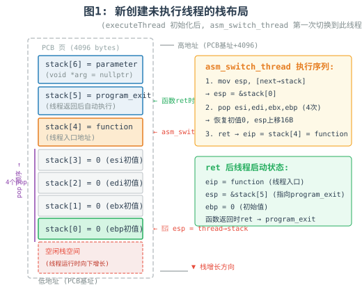
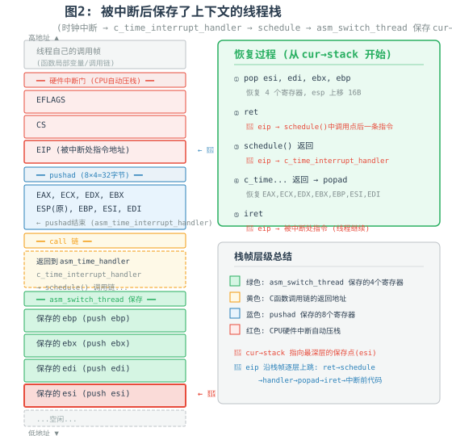

# <center>Lab5 内核线程</center>

>  本次实验部分代码和注释参考自大模型。

> 实验环境：Ubuntu 22.04 (x86_64), GCC 11.4.0 (with -m32), QEMU emulator version 8.2.0 (qemu-system-i386), NASM 2.16.01, GDB 15.2

## Assignment1 printf的实现

C语言的可变参数机制是理解 `printf` 实现的核心基础。在保护模式下，函数的参数被从右到左依次压入栈中，而可变参数函数并不知道参数的具体数量和类型，因此需要借助 `va_list`、`va_start`、`va_arg`、`va_end` 这组宏来访问栈上的参数。

在理解可变参数机制后，`printf` 的实现便水到渠成。我们采用逐字符解析配合缓冲区输出：遍历格式化字符串 `fmt`，普通字符直接写入缓冲区 `buffer`；遇到 `%` 则解析后续格式字符，从可变参数列表中取出对应参数并转换后写入缓冲区。当缓冲区满（达到 `BUF_LEN=32`）时一次性输出并清空，这种设计避免了输出长字符串时栈空间不足的问题。

### 1.1 基本 printf

在 `src/3` 的基础上实现了基础 `printf`，支持 `%c`（字符）、`%s`（字符串）、`%d`（有符号十进制整数）、`%x`（十六进制）和 `%%`（输出百分号）五种格式化输出。对于 `%d` 和 `%x`，借助 `itos` 函数将整数转换为对应进制的字符串表示，负数前先输出负号再取其绝对值转换。


如图所示，基本 printf 正确输出了五种格式的测试结果。

### 1.2 增强 printf

在 1.1 的基础上，对格式解析进行了重构：`%` 后不再是简单读一个字符，而是先解析可选的 `0` 标志和宽度数字，再进入格式字符的 switch 分支。这样 `%08d` 会被解析为 `zero_pad=true, width=8, fmt_char='d'`。

新增了四种格式化输出支持：

| 格式 | 实现原理 | 示例 | 输出 |
|------|---------|------|------|
| `%o` | 调用 `itos(number, temp, 8)` 输出八进制 | `%o(255)` | `377` |
| `%u` | 将参数强转为 `uint32` 后调用 `itos(..., 10)` | `%u(-1)` | `4294967295` |
| `%p` | 固定输出 `0x` 前缀 + 至少 8 位零填充十六进制 | `%p(&val)` | `0x0001A2B3` |
| `%0Nd` | 解析宽度 N，不足时高位补零，负数符号在前 | `%08d(-42)` | `-0000042` |

`%p` 的实现较为特殊：它固定输出 8 位，不受 `%0N` 宽度的影响。`%0Nd` 的负数处理符合 C 标准——符号出现在零填充之前，如 `-0000042`。


从截图中可以看到，所有新增格式均正确输出，增强 printf 实现完成。


## Assignment2 线程的实现

线程是操作系统中最小的调度单位。在本实验中，我们直接在内核中实现了线程机制。每个线程由 PCB（Process Control Block）来描述，PCB 中包含了线程的栈指针、状态、优先级、pid 和运行时间等关键信息。线程的栈就保存在 PCB 内部——每个 PCB 分配一页（4096 字节），栈从页顶向下增长。

PCB 的核心字段定义如下：

| 字段 | 含义 |
|------|------|
| `stack` | 线程栈指针，用于调度时保存/恢复 esp |
| `status` | 线程状态（CREATED/RUNNING/READY/BLOCKED/DEAD） |
| `priority` | 优先级，决定时间片大小（`ticks = priority × 10`） |
| `pid` | 线程标识符 |
| `ticks` | 剩余时间片计数，归零时触发调度 |
| `tagInGeneralList` / `tagInAllList` | 就绪队列 / 全局队列中的链表节点 |

PCB 的分配采用预置数组 `PCB_SET` 的方式：在内存中预留 `MAX_PROGRAM_AMOUNT` 个 PCB 的空间，`allocatePCB` 遍历状态数组返回未使用的 PCB，`releasePCB` 则将其状态重置。

### 2.1 基本线程

线程由 `executeThread` 函数创建，其核心是为线程初始化栈帧。栈帧布局如下（`thread->stack` 初始化为 `PCB基址+4096`，然后减 7）：

```
stack[6] = parameter   ← 线程函数参数
stack[5] = program_exit ← 线程返回地址（函数退出后自动执行）
stack[4] = function    ← 线程入口函数地址
stack[3] = 0 (esi)
stack[2] = 0 (edi)     ← asm_switch_thread pop 顺序
stack[1] = 0 (ebx)
stack[0] = 0 (ebp)     ← thread->stack 指向此处
```

之所以要放入 4 个 0 值寄存器，是因为 `asm_switch_thread` 在切换线程时会执行 `pop esi; pop edi; pop ebx; pop ebp`。对于新创建的线程，这些寄存器的初值就是 0。随后 `ret` 指令弹出 `stack[4]` 作为 `eip`，跳转到线程函数执行。线程函数执行完毕后的 `ret` 则会弹出 `stack[5]`，即 `program_exit` 的地址，从而自动完成线程退出和 PCB 回收。

**关于第一个线程的特殊处理：** 系统中第一个线程无法通过时钟中断调度上处理器（因为中断还未开启）。因此在 `setup_kernel` 中手动将其从就绪队列取出，设置状态为 RUNNING，然后调用 `asm_switch_thread(0, firstThread)` 强制切换。注意第一个线程（pid=0）不允许返回，因为 `program_exit` 中判断 pid==0 时会直接 halt 系统。若第一个线程返回，系统将停机。


从截图中可以看到，基本线程的创建和调度正常，三个线程依次执行并打印各自的 PID、优先级和剩余 ticks，子线程执行完毕后自动退出，主线程最后 halt 系统。

### 2.2 多线程并发展示

在多线程环境下，如果多个线程同时使用 `printf` 输出，由于 `printf` 操纵的是全局光标位置，会发生输出内容相互覆盖的问题。为了解决这个问题，我们直接操作 VGA 显存来实现定位输出——每个线程在屏幕的不同行打印自己的标识和计数器，彻底避免光标竞争。

VGA 文本模式下，显存起始地址为 `0xB8000`，每个字符占 2 字节（ASCII 码 + 颜色属性）。屏幕分辨率为 80 列 × 25 行，因此第 `row` 行第 `col` 列的显存偏移为 `(row × 80 + col) × 2`。

三个线程被创建为：

| 线程 | PID | 优先级 | 输出行 | 颜色 |
|------|-----|--------|--------|------|
| Thread1 (first_thread) | 0 | 1 | 第 3 行 | 绿色 |
| Thread2 | 1 | 1 | 第 10 行 | 青色 |
| Thread3 | 2 | 1 | 第 17 行 | 品红 |

每个线程在循环中不断递增计数器并输出，通过时间片轮转调度交替执行。时钟中断频率约为 18.2 Hz，每个线程的时间片为 `priority × 10 = 10` 个 tick，因此每次调度约持续 0.55 秒。


从截图中可以观察到以下调度行为：

- **谁先执行？** `first_thread`（pid=0）先执行，因为在 `setup_kernel` 中被手动切换上处理器。
- **线程如何交替？** 时钟中断到来时递减当前线程的 `ticks`，归零后调用 `schedule()` 将当前线程放回就绪队列队尾，取队首线程运行——纯时间片轮转（RR）调度。
- **计数器速度对比：** 三个线程的优先级均为 1（时间片相等），因此计数器增速大致相近，体现了 RR 算法的公平性。
- 

## Assignment3 线程调度切换的秘密

线程能够并发执行的秘密在于：中断线程的执行 → 保存当前线程状态 → 调度下一个线程上处理机 → 使被调度上处理机的线程从之前被中断点处恢复执行。

> GDB 结果可在  /Assignment3/3.1/gdb_trace.txt 查看

### 3.1 跟踪线程切换

为了追踪线程切换的完整过程，我们编写了自动化 GDB 批处理脚本 `gdb_analyze`，在无图形界面的纯文本环境下连接到 QEMU 的 GDB 调试服务器，在关键函数处设置断点并自动输出寄存器、栈和 PCB 状态信息。

**调试环境与方法：**

```shell
# 终端1: 启动 QEMU（CPU 挂起，GDB 服务器端口 1234）
qemu-system-i386 -hda ../run/hd.img -display none -S -s -no-reboot

# 终端2: GDB 批处理分析
cd ../run && gdb -batch -x gdb_analyze
```

设置了 4 个关键断点覆盖线程切换全链路：

| 断点 | 位置 | 观察目的 |
|------|------|---------|
| BP1 | `first_thread` | 新线程首次被调度执行的时刻 |
| BP2 | `c_time_interrupt_handler` | 时钟中断触发、ticks 递减过程 |
| BP3 | `asm_switch_thread` 入口 | 上下文切换前 cur/next 的 PCB 指针和栈指针 |
| BP4 | `asm_switch_thread + 22`（`ret` 前） | 切换完成后 esp、寄存器、当前运行线程 |

---

#### 场景A：新创建的线程如何被调度并开始执行

这是系统的第一次上下文切换，由 `setup_kernel` 主动调用 `asm_switch_thread(0, firstThread)` 触发，而非时钟中断。

**步骤1 — BP3 #1 命中（`asm_switch_thread` 入口）：**

```
===== BP3 asm_switch_thread #1 ENTRY =====
cur(PCB*)=0x0  next(PCB*)=0x21fe0
next->stack=0x22fc4
```

此时 `cur=0x0`（首次切换，无"当前线程"），`next=0x21fe0` 指向 firstThread 的 PCB。`next->stack=0x22fc4` 是 `executeThread` 初始化时预设的栈指针值。

**步骤2 — 栈切换与寄存器恢复（`asm_switch_thread` 内部）：**

汇编代码依次执行 `mov esp, [eax]`（从 `next->stack` 加载 esp）→ `pop esi; pop edi; pop ebx; pop ebp`（依次恢复 4 个通用寄存器，初值均为 0）→ `sti`（开中断）→ `ret`（弹出返回地址，实际弹出的是线程入口函数地址）。

**步骤3 — BP1 命中（`first_thread` 入口）：**

```
===== BP1 first_thread ENTRY =====
PCB: pid=0 name=thread1 status=1(RUNNING) priority=1
Regs: eip=0x209a9  esp=0x22fd8  ebp=0x0
Stack (top 6 words):
0x22fd8: 0x00020671  0x00000000  0x00000000  0x00000000
0x22fe8: 0x00000000  0x00000000
```

新线程成功开始执行！关键观察：
- **`eip=0x209a9`**：即 `first_thread` 函数的入口地址（由 `ret` 从 `stack[4]` 弹出）
- **`ebp=0x0`**：初始化为 0，与 `stack[0]` 的预设值一致
- **`esp=0x22fd8`**：比 `next->stack=0x22fc4` 增加了 20 字节（=`0x14`），恰好等于 4 个 `pop`（16 字节）+ 1 个 `ret`（4 字节）
- **栈顶 `0x00020671`**：这是 `program_exit` 的地址（`stack[5]`），当 `first_thread` 返回时 `ret` 将弹出此地址，自动执行线程退出逻辑

| 栈偏移 | 预设值 | `asm_switch_thread` 操作 | 新线程所见 |
|--------|--------|------------------------|-----------|
| `stack[0]` | 0 (ebp初值) | `pop ebp` → ebp=0 | ebp=0 |
| `stack[1]` | 0 (ebx初值) | `pop ebx` → ebx=0 | — |
| `stack[2]` | 0 (edi初值) | `pop edi` → edi=0 | — |
| `stack[3]` | 0 (esi初值) | `pop esi` → esi=0 | — |
| `stack[4]` | `function` | `ret` → eip=function | eip=first_thread |
| `stack[5]` | `program_exit` | 函数返回时 `ret` 弹出 | 返回地址 |
| `stack[6]` | `parameter` | 函数参数 | `arg` |

**结论：** 新线程通过 `executeThread` 预设的栈帧，配合 `asm_switch_thread` 的 4 个 `pop` + 1 个 `ret` 指令序列，被"欺骗"认为自己是一个正常被调用然后被切换回来的函数，从而无缝开始执行。

---

#### 场景B：运行中线程被中断、换下、再恢复执行

当时钟中断触发且当前线程的时间片耗尽时，调度器介入完成线程切换。以下是从 GDB 跟踪中提取的一次完整切换过程。

**阶段1 — 时间片递减（BP2 时钟中断序列）：**

```
--- CLOCK #1: pid=0 ticks=10 ticksPassed=0 ---
--- CLOCK #2: pid=0 ticks=9  ticksPassed=1 ---
--- CLOCK #3: pid=0 ticks=8  ticksPassed=2 ---
--- CLOCK #4: pid=0 ticks=7  ticksPassed=3 ---
--- CLOCK #5: pid=0 ticks=6  ticksPassed=4 ---
```

每次时钟中断（约 18.2 Hz），`c_time_interrupt_handler` 将当前线程的 `ticks` 减 1。当 `ticks` 从 1 减到 0 时，`schedule()` 被调用。

**阶段2 — 调度决策（`schedule()` 内部）：**

1. `running->status` 从 `RUNNING` 改为 `READY`
2. `running->ticks` 重置为 `priority × 10`
3. 当前线程被 `push_back` 到就绪队列尾部
4. 从就绪队列取队首作为 `next`

**阶段3 — 上下文切换（BP3 #2 命中）：**

```
===== BP3 asm_switch_thread #2 ENTRY =====
cur(PCB*)=0x21fe0  next(PCB*)=0x22fe0
cur->stack=0x22fc4  next->stack=0x23fc4
```

- `cur=0x21fe0`：thread1（pid=0）即将被换下
- `next=0x22fe0`：thread2（pid=1）即将被换上
- `cur->stack=0x22fc4`：thread1 当前的 esp 将保存至此
- `next->stack=0x23fc4`：thread2 的栈指针（上次被中断时保存的 esp）

`asm_switch_thread` 内部执行流程：
1. `push ebp; push ebx; push edi; push esi` — 保存 cur 的 4 个寄存器到 cur 的栈
2. `mov [eax], esp` — 将 esp 保存到 `cur->stack`（此时 `cur->stack=0x22f1c`，即新保存的 esp 值）
3. `mov esp, [eax]` — 从 `next->stack` 加载 esp，栈切换到 thread2
4. `pop esi; pop edi; pop ebx; pop ebp` — 恢复 thread2 之前保存的寄存器

**阶段4 — 切换完成（BP4 命中，`ret` 之前）：**

```
>>> BP4 asm_switch_thread ABOUT TO RET <<<
esp=0x23f1c  ebp=0x23f28  esi=0x0  edi=0x0  ebx=0x0
ret addr on stack = 0x202b7
Now running: pid=1 name=thread2
```

关键观察：
- **`esp=0x23f1c`**：已切换到 thread2 的栈空间（初始 next->stack=0x23fc4，4 个 pop 后增加 16 字节到 0x23f1c）
- **`ebp=0x23f28`**：thread2 之前执行时的 ebp（由 last pop 恢复）
- **`ret addr=0x202b7`**：栈顶的返回地址，`ret` 执行后 eip 将跳转至此
- **`Now running: pid=1`**：`programManager.running` 已更新为 thread2

此后 `asm_switch_thread` 执行 `sti`（开中断）和 `ret`，eip 跳转到 `0x202b7`（即 `schedule()` 中 `asm_switch_thread` 调用后的下一条指令），thread2 从上次被中断的位置继续执行。

**阶段5 — 后续轮转验证：**

GDB 继续捕获了完整的轮转序列：

```
BP3 #3: cur=0x22fe0(thread2) → next=0x23fe0(thread3)
BP4:    Now running: pid=2 name=thread3

BP3 #4: cur=0x23fe0(thread3) → next=0x21fe0(thread1)
BP4:    Now running: pid=0 name=thread1

BP3 #5: cur=0x21fe0(thread1) → next=0x22fe0(thread2)
BP4:    Now running: pid=1 name=thread2
...
```

三个线程严格按照 `0 → 1 → 2 → 0 → 1 → 2 → ...` 的顺序无限轮转，每次 `ret addr = 0x202b7`（固定返回 `schedule()`），验证了 RR 调度算法的正确性。

**结论：** 线程的"被中断 → 换下 → 恢复"过程由硬件（时钟中断自动压栈 EFLAGS/CS/EIP）和软件（`pushad` + `push ebp/ebx/edi/esi`）双层栈帧保存机制协作完成。被中断线程的完整上下文保存在自己的内核栈中，`cur->stack` 指针指向最深层的保存点。当该线程再次被调度时，`asm_switch_thread` 通过 `mov esp, [next->stack]` 一步切换到其栈，然后依次 `pop` 恢复寄存器，最后 `ret` 跳回中断前的执行点——整个过程对线程本身完全透明。

| PCB 地址 | 线程 | stack 初始值 | 中断后保存的 esp |
|----------|------|-------------|-----------------|
| `0x21fe0` | thread1 (pid=0) | `0x22fc4` | `0x22f1c` |
| `0x22fe0` | thread2 (pid=1) | `0x23fc4` | `0x23f1c` |
| `0x23fe0` | thread3 (pid=2) | `0x24fc4` | `0x24f1c` |

每个 PCB 恰好相隔 `0x1000`（4096 = PCB_SIZE），验证了 `PCB_SET` 数组的连续分配。
### 3.2 分析线程栈布局

结合 GDB 调试数据和对 `executeThread`、`asm_switch_thread` 的代码分析，下面两幅图精确描述了线程在两种关键时刻的栈布局。

#### 情况一：新创建尚未执行的线程栈



`executeThread` 在创建线程时，手动初始化了 7 个栈槽：

- **stack[0]~stack[3]**（4 个 0）：对应 `asm_switch_thread` 中 `pop esi; pop edi; pop ebx; pop ebp` 的恢复序列。新线程没有"之前"的状态，因此初值全为 0
- **stack[4] = function**：`asm_switch_thread` 的 `ret` 指令将从这里弹出 eip，使 CPU 跳转到线程入口函数
- **stack[5] = program_exit**：线程函数执行完毕后的 `ret` 指令弹出此地址，自动执行退出处理
- **stack[6] = parameter**：线程函数的参数（`void *arg`）

当 `asm_switch_thread` 被调用切换到新线程时：
1. `mov esp, [next->stack]` 将 esp 设为 `&stack[0]`
2. 依次 `pop esi, edi, ebx, ebp`（均为 0）
3. `ret` 弹出 `function` → **eip 跳转到线程入口函数**
4. 此时 esp 指向 `stack[5]`（`program_exit`），ebp=0

#### 情况二：被中断后保存了上下文的线程栈



线程被时钟中断抢占后，栈上保存了完整的上下文，从底到顶共包含四层：

**第一层（硬件中断门）**：CPU 响应中断时自动压栈 EFLAGS、CS、EIP。`iret` 指令恢复线程时将反向弹出这三者，使 CPU 回到被中断的指令继续执行。

**第二层（pushad）**：`asm_time_interrupt_handler` 入口处的 `pushad` 指令保存了 8 个通用寄存器（EAX、ECX、EDX、EBX、ESP、EBP、ESI、EDI），共计 32 字节。

**第三层（call 链）**：从 `c_time_interrupt_handler` → `schedule` → `asm_switch_thread` 的层层调用，每层在栈上留下返回地址。

**第四层（asm_switch_thread 的 4 个 push）**：`push ebp; push ebx; push edi; push esi`。执行完毕后，esp 指向最深层的 esi 保存点，`cur->stack` 即保存此时的 esp 值。

**恢复过程**（当该线程再次被调度时）：
```
pop esi,edi,ebx,ebp → ret → [schedule] → [c_time...] → popad → iret → 被中断代码
  ↑ 恢复4寄存器      ↑ eip跳转   ↑ 层层返回   ↑ 恢复8寄存器  ↑ CPU弹出CS:EFLAGS:EIP
```

**与 GDB 数据的对照验证：**

GDB 分析中观察到的 `cur->stack` 保存值 `0x22f1c`，与该线程初始栈指针 `0x22fc4` 相差 `0xa8`（168 字节），这些差值恰好对应了四层栈帧的总大小——中断帧 + pushad + call 链 + 4 个 push。这精确验证了栈布局分析的正确性。


## Assignment4 调度算法的实现

时间片轮转（RR）算法虽然公平，但在实际系统中往往无法满足不同优先级任务的响应需求。本实验将默认的 RR 调度改为优先级调度，并对比分析两者的差异。

### 4.1 实现优先级调度算法

**核心改动——`schedule()` 的调度策略：**

```cpp
// 原始RR调度：取就绪队列队首
ListItem *item = readyPrograms.front();
PCB *next = ListItem2PCB(item, tagInGeneralList);
readyPrograms.pop_front();

// 改为优先级调度：遍历就绪队列，选priority最小的线程
ListItem *best = readyPrograms.front();
PCB *bestPCB = ListItem2PCB(best, tagInGeneralList);
ListItem *temp = best;
while (temp) {
    PCB *p = ListItem2PCB(temp, tagInGeneralList);
    if (p->priority < bestPCB->priority) { best = temp; bestPCB = p; }
    temp = temp->next;
}
PCB *next = bestPCB;
readyPrograms.erase(best);
```

同优先级的线程按照 FCFS（先来先服务）顺序处理。调度仍为抢占式——时钟中断驱动，`ticks` 归零时触发重调度。

**测试线程设计：**

| 线程 | priority | 输出行 | 预期行为 |
|------|----------|--------|---------|
| thread_high | 1（最高） | 行 1 | 计数器增长最快 |
| thread_mid | 2 | 行 3 | 增速中等 |
| thread_low | 3（最低） | 行 5 | 增长最慢，可能饥饿 |


从截图中可以观察到：在优先级调度下，高优先级线程（pid=1）的计数器远快于中、低优先级的线程，验证了优先级调度的正确性——高优先级线程获得了更多的 CPU 时间。

### 4.2 对比分析

使用完全相同的三个测试线程，在 4.1（优先级调度）和 4.2（RR 调度）中分别运行，对比结果如下：

| 对比维度 | RR 调度 | 优先级调度 |
|---------|---------|-----------|
| **执行顺序** | 0→1→2→0→1→2 均匀轮转 | 高优先频繁执行，低优先被抢占 |
| **计数器增速** | 三个线程增速相近 | pri=1 最快，pri=3 最慢 |
| **公平性** | ✅ 高——每个线程获得等长时间片 | ❌ 低——低优先级可能饥饿 |
| **响应性** | 均等——所有线程响应时间相近 | 高优先级响应快，低优先级可能长时间得不到 CPU |


**两种算法的优缺点分析：**

**RR 调度**的优点在于实现简单、公平性好，每个线程获得等长的 CPU 时间片，不会发生饥饿。缺点是所有线程一视同仁，无法区分紧急任务和后台任务。

**优先级调度**的优点是可以区分任务的重要程度，高优先级任务能获得更快的响应，适合实时性要求高的场景。缺点是没有老化机制时低优先级线程可能长期得不到 CPU（饥饿问题），且可能出现优先级反转问题。

本实验中可以清晰看到：同一个低优先级线程在 RR 下能获得与高优先级线程相近的 CPU 时间，而在优先级调度下则显著落后。


## Assignment5 线程的生命周期管理（选做题）

在实际操作系统中，线程不仅仅是被动地由时钟中断调度，还需要主动让出 CPU 以及等待某些条件满足后继续执行的能力。本实验实现了 `thread_yield`（主动让出）、`thread_sleep`（阻塞）和 `thread_wakeup`（唤醒）三个核心生命周期管理函数。

### 5.1 实现 `thread_yield`

`thread_yield` 使当前线程主动放弃 CPU，其逻辑与 `schedule` 类似，但关键区别在于**不清零 `ticks`**——主动让出不同于时间片耗尽被强制调度。

```cpp
void thread_yield() {
    PCB *cur = programManager.running;
    cur->status = READY;
    // ticks 不清零！—— 这是与时间片耗尽调度的核心区别
    programManager.readyPrograms.push_back(&(cur->tagInGeneralList));
    programManager.schedule();  // 选下一个就绪线程
}
```

测试设计：2 个线程，每个循环 3 次，每次打印后调用 `thread_yield()`，预期看到线程交替执行。


从截图中可以看到，两个线程通过 `yield` 主动交替，每次切换都不浪费剩余的时间片。

### 5.2 实现 `thread_sleep` 和 `thread_wakeup`

`thread_sleep` 和 `thread_wakeup` 实现了线程的阻塞与唤醒机制，这是后续实现信号量和锁的基础。完整的线程状态变迁如下：

```
                   executeThread()
 (不存在) ─────────────────────→ READY ──→ schedule() → RUNNING
                                     ↑         │
                                     │         ├─ ticks归零 → schedule() → READY
                                     │         ├─ thread_yield() → READY
                                     │         ├─ thread_sleep() → BLOCKED
                                     │         └─ 函数返回 → program_exit() → DEAD
                                     │
                               thread_wakeup()
                             BLOCKED ─────────→ READY
```

**`thread_sleep` 的实现：**

```cpp
void thread_sleep(List *waitList) {
    PCB *cur = programManager.running;
    cur->status = BLOCKED;
    waitList->push_back(&(cur->tagInGeneralList));
    programManager.schedule();  // BLOCKED 线程不会重复入就绪队列
}
```

**`thread_wakeup` 的实现：**

```cpp
void thread_wakeup(PCB *thread, List *waitList) {
    // 操作链表时关中断保护，避免被时钟中断打断
    bool status = interruptManager.getInterruptStatus();
    interruptManager.disableInterrupt();
    waitList->erase(&(thread->tagInGeneralList));
    thread->status = READY;
    programManager.readyPrograms.push_back(&(thread->tagInGeneralList));
    interruptManager.setInterruptStatus(status);
}
```

**关键设计要点：**

1. **`schedule()` 无需修改**——BLOCKED 线程已从就绪队列移至等待队列，`schedule()` 遍历就绪队列时自然跳过它
2. **关中断保护**——`thread_wakeup` 操作链表时必须关中断，防止操作过程中被时钟中断打断导致链表不一致
3. **`thread_sleep` 后调用 `schedule()`**——`schedule()` 发现当前线程状态为 BLOCKED，不会将其放回就绪队列

测试设计：sleeper 线程先打印然后调用 `thread_sleep` 进入阻塞，waker 线程运行数轮后调用 `thread_wakeup` 唤醒 sleeper。


从截图中可以观察到完整的生命周期变化过程：
- sleeper 进入 BLOCKED 状态后，被移除就绪队列，不再参与调度
- waker 获得 CPU 后运行数轮，然后主动唤醒 sleeper
- sleeper 被唤醒后状态变为 READY，重新进入就绪队列
- 下次调度时 sleeper 获得 CPU，从 `thread_sleep` 返回处继续执行，输出 "WOKEN UP!"

这一机制验证了线程状态变更的完整性，也证明了 `schedule()` 对 BLOCKED 状态的自然跳过处理正确无误。

