# <center>lab8</center>

> **本次实验部分代码、注释和报告整理参考自大模型。**

## Assignment 1 — 系统调用与特权级转换

### 1.1 复现系统调用并分析特权级机制

本小节先复现 `src/2` 的系统调用代码，再在 `Assignment1/1.1` 中新增两个系统调用：`max(a, b)` 和 `factorial(n)`。

**复现现象：**

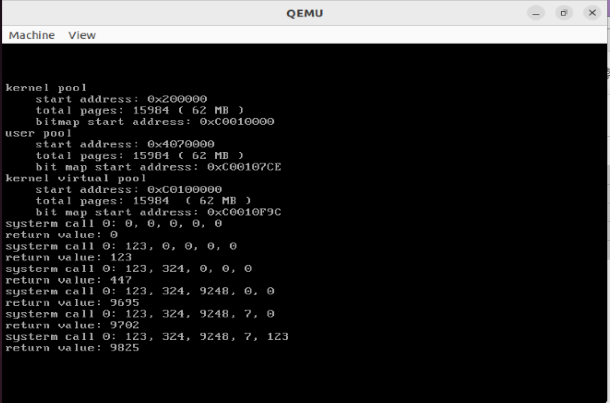

图中可以看到 `syscall_0` 被多次调用，内核打印了寄存器传入的参数，并返回参数和。这说明 `asm_system_call` 能够通过 `int 0x80` 进入内核态并调用系统调用表中的函数。

**新增系统调用实现：**

在 `Assignment1/1.1/include/syscall.h` 中声明：

```cpp
int syscall_max(int first, int second, int third, int forth, int fifth);
int syscall_factorial(int first, int second, int third, int forth, int fifth);

int max(int a, int b);
int factorial(int n);
```

用户态包装函数位于 `src/kernel/syscall.cpp`：

```cpp
int max(int a, int b) {
    return asm_system_call(1, a, b);
}

int factorial(int n) {
    return asm_system_call(2, n);
}
```

内核态处理函数如下：

```cpp
int syscall_max(int first, int second, int third, int forth, int fifth) {
    return (first > second) ? first : second;
}

int syscall_factorial(int first, int second, int third, int forth, int fifth) {
    int n = first;
    if (n <= 1) return 1;
    int result = 1;
    for (int i = 2; i <= n; ++i) {
        result *= i;
    }
    return result;
}
```

在 `setup_kernel` 中注册系统调用：

```cpp
systemService.setSystemCall(1, (int)syscall_max);
systemService.setSystemCall(2, (int)syscall_factorial);
```

**实验现象：**

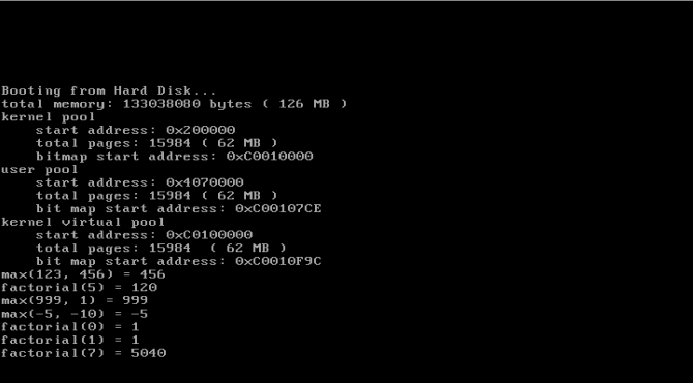

图中输出：

```text
max(123, 456) = 456
factorial(5) = 120
max(999, 1) = 999
max(-5, -10) = -5
factorial(0) = 1
factorial(1) = 1
factorial(7) = 5040
```

**结果分析：** 这些结果覆盖了普通正数、负数比较以及阶乘的边界值 `0/1`。输出正确说明 1 号和 2 号系统调用已经成功注册，用户态包装函数传参正确，内核态处理函数也能把返回值通过 `eax` 带回调用者。

**系统调用完整流程：**

```text
用户代码 max/factorial
-> asm_system_call
-> eax 放系统调用号，ebx/ecx/edx/esi/edi 放参数
-> int 0x80
-> CPU 根据 IDT 进入 asm_system_call_handler
-> asm_system_call_handler 根据 eax 查 system_call_table
-> 调用 syscall_max/syscall_factorial
-> 返回值保存到 eax
-> iret 返回原执行流
```

特权级切换发生在 `int 0x80` 处。IDT 中 0x80 中断门的 DPL 设置为 3，因此用户态可以主动触发；CPU 进入内核态后使用内核代码段和内核栈执行 handler，最后通过 `iret` 恢复用户态现场。

### 1.2 GDB 分析栈与段寄存器变化

本小节使用 GDB 在 `Assignment1/1.2` 中观察系统调用前后 `CS/SS/ESP/EIP` 的变化，重点分析 `TSS.ss0` 和 `TSS.esp0` 在特权级切换中的作用。

**调试方法：**

```bash
cd Assignment1/1.2/build
make clean && make build
qemu-system-i386 -hda ../run/hd.img -S -s -parallel stdio -serial null -no-reboot
```

另开一个终端连接 GDB：

```bash
cd Assignment1/1.2/build
gdb -q kernel.o
target remote :1234
set disassembly-flavor intel
set pagination off
```

本次设置 3 个关键断点：

```gdb
b *0xc00226bd
b *0xc0022667
b *0xc00226a2
c
```

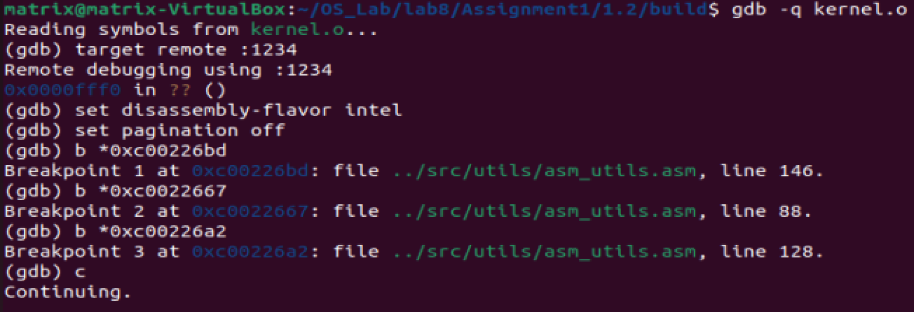

图 1.2-1 中，`0xc00226bd` 是 `asm_system_call` 中的 `int 0x80` 指令，`0xc0022667` 是 `asm_system_call_handler` 入口，`0xc00226a2` 是 handler 末尾的 `iret`。

**1. 执行 `int 0x80` 之前：**

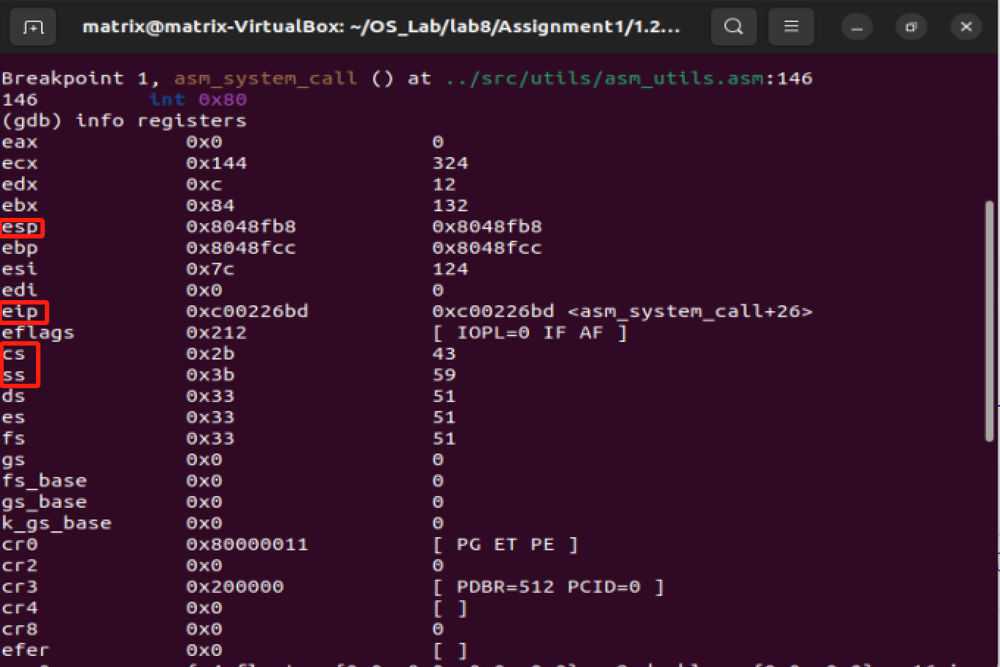

图 1.2-2 显示此时程序断在 `asm_system_call` 的 `int 0x80` 指令处，关键寄存器如下：

```text
CS=0x2b, SS=0x3b, ESP=0x8048fb8, EIP=0xc00226bd, CPL=3
```

**结果分析：** `CPL = CS & 0x3 = 0x2b & 0x3 = 3`，说明当前仍处于用户态。`EIP=0xc00226bd` 正好指向 `int 0x80`，系统调用号和参数已经通过 `eax/ebx/ecx/edx/esi/edi` 准备好。

**2. 进入 `asm_system_call_handler` 之后：**

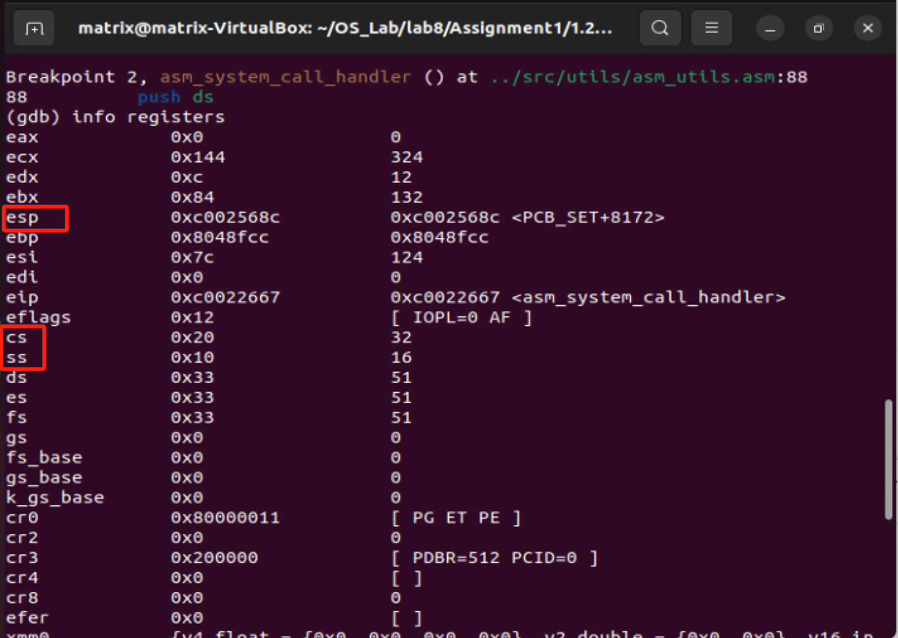

图 1.2-3 显示执行 `int 0x80` 后，CPU 进入 `asm_system_call_handler`：

```text
CS=0x20, SS=0x10, ESP=0xc002568c, EIP=0xc0022667, CPL=0
```

**实验现象：** `CS` 从 `0x2b` 变为 `0x20`，`SS` 从 `0x3b` 变为 `0x10`，`ESP` 切换到 `0xc002568c` 附近的内核栈。

**原因：** 系统调用通过中断门从 CPL=3 进入 CPL=0。发生特权级提升时，CPU 会从当前 TSS 中读取 `ss0=0x10` 和 `esp0=0xc00256a0`，切换到 0 特权级栈，然后把用户态返回现场压入这个内核栈。

**内核栈现场：**

```text
0xc002568c: 0xc00226bf  0x0000002b  0x00000212  0x08048fb8
0xc002569c: 0x0000003b
```

这 5 个值依次是 CPU 自动压入内核栈的用户态现场：

```text
EIP     = 0xc00226bf
CS      = 0x2b
EFLAGS  = 0x212
ESP     = 0x8048fb8
SS      = 0x3b
```

**3. 执行 `iret` 前后：**

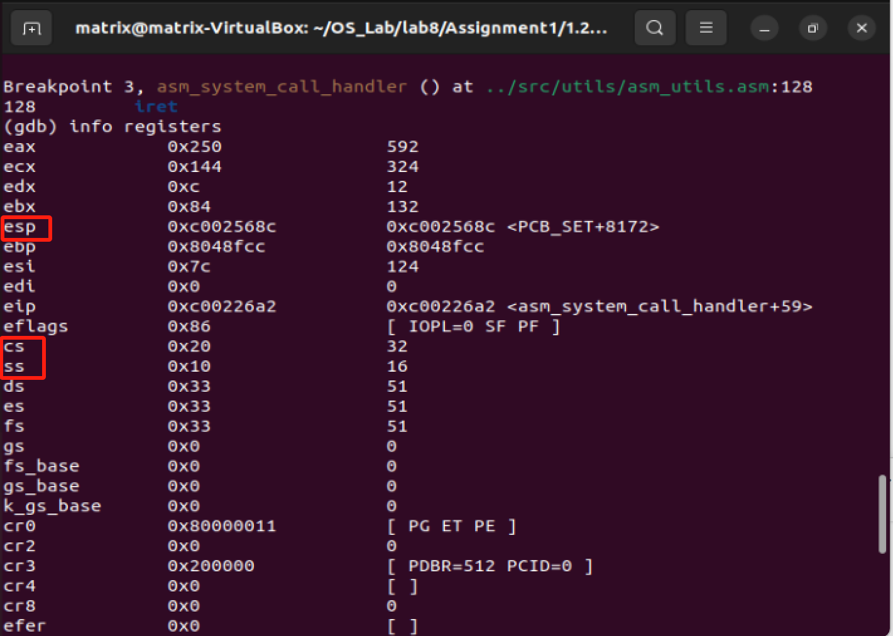

图 1.2-4 显示 handler 即将执行 `iret`，此时仍在内核态：

```text
CS=0x20, SS=0x10, ESP=0xc002568c, EIP=0xc00226a2
```

这说明内核栈顶仍然指向进入中断时保存的用户态现场。

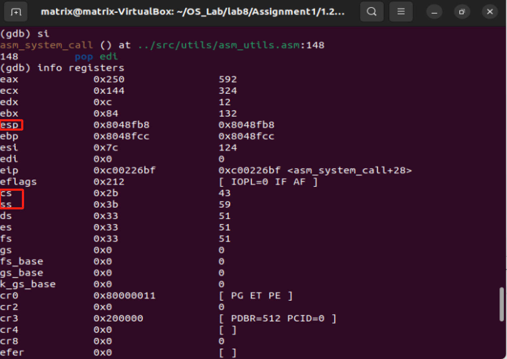

图 1.2-5 显示单步执行 `iret` 后寄存器恢复为：

```text
CS=0x2b, SS=0x3b, ESP=0x8048fb8, EIP=0xc00226bf, CPL=3
```

**结果分析：** `iret` 从当前内核栈弹出 `EIP/CS/EFLAGS/ESP/SS`。因此 `CS/SS/ESP` 恢复为用户态的值，`EIP=0xc00226bf` 指向 `int 0x80` 后的下一条指令，程序继续在用户态执行。

**问题回答：**

1. `int 0x80` 之前，`CS=0x2b`、`SS=0x3b`、`ESP=0x8048fb8`、`EIP=0xc00226bd`，`CPL=3`。

2. 进入 `asm_system_call_handler` 后，`CS=0x20`、`SS=0x10`、`ESP=0xc002568c`，`CPL=0`。新的 `SS` 和内核栈初始地址来自 TSS 中的 `ss0` 和 `esp0`。

3. 执行 `iret` 后，`CS=0x2b`、`SS=0x3b`、`ESP=0x8048fb8`、`EIP=0xc00226bf`，CPU 回到用户态。这些值保存在进入中断时 CPU 自动压入的内核栈现场中。

4. `TSS.ss0` 和 `TSS.esp0` 的作用是在用户态进入内核态时提供 0 特权级栈。CPU 不使用用户栈处理内核代码，而是切换到当前进程对应的内核栈，保证内核态处理过程有可信的栈空间。

---

## Assignment 2 — 进程创建与 Fork

### 2.1 进程的创建过程分析

本小节基于 `src/3`，在内核线程中创建 3 个用户进程，并让它们通过系统调用输出不同参数。

**复现现象：**

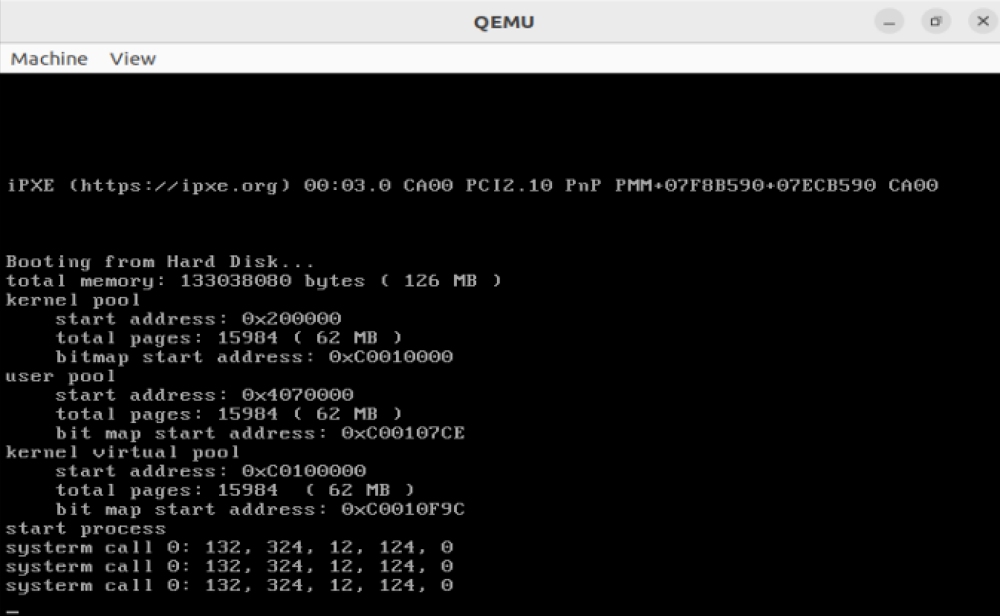

**修改后现象：**

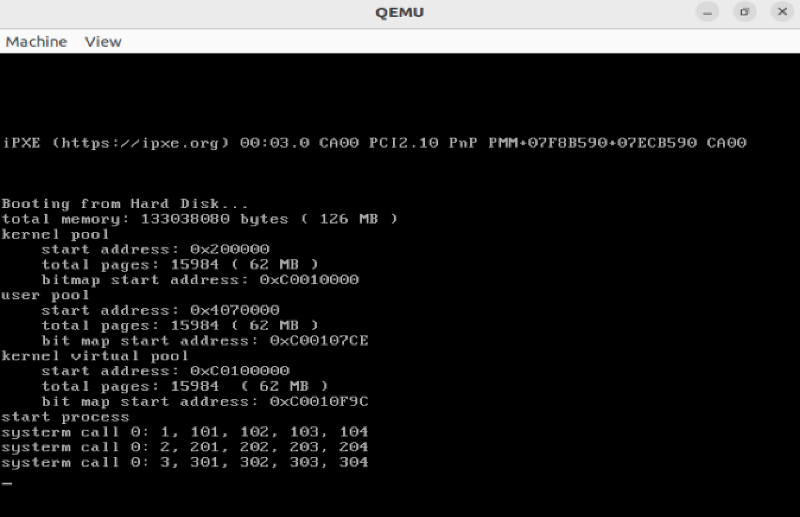

图中可以看到：

```text
systerm call 0: 1, 101, 102, 103, 104
systerm call 0: 2, 201, 202, 203, 204
systerm call 0: 3, 301, 302, 303, 304
```

**实现思路：** 在 `first_thread` 中连续调用 `executeProcess` 创建 3 个用户进程，每个进程调用 `asm_system_call(0, ...)`，用第一项参数 `1/2/3` 区分进程身份。

**进程创建三步分析：**

第一步，`executeProcess()` 先调用 `executeThread()` 分配 PCB，然后设置进程专有字段：

```cpp
process->pageDirectoryAddress = createProcessPageDirectory();
createUserVirtualPool(process);
```

因此，用户进程是在内核线程 PCB 的基础上扩展出来的，额外拥有页目录表和用户虚拟地址池。

第二步，用户进程第一次运行时先进入 `load_process()`，在 PCB 顶部构造 `ProcessStartStack`，填入用户态 `cs/ss/eip/esp/eflags` 等现场，然后调用 `asm_start_process()`。`asm_start_process` 最后执行 `iret`，CPU 从构造好的栈中弹出用户态现场，进入 CPL=3 执行用户进程入口函数。

第三步，调度器选中下一个进程后调用 `activateProgramPage(next)`。如果 `next->pageDirectoryAddress != 0`，说明它是用户进程，内核会设置：

```cpp
tss.esp0 = (int)program + PAGE_SIZE;
asm_update_cr3(paddr);
```

这样既为该进程准备了进入内核态时使用的 0 特权级栈，也把 `CR3` 切换到该进程的页目录表。

**pageDirectoryAddress 区别：** 内核线程运行在共享内核地址空间，不需要独立页目录表，所以 `pageDirectoryAddress = 0`。用户进程需要独立虚拟地址空间，因此 `executeProcess()` 会创建页目录表，`pageDirectoryAddress != 0`。调度器也正是通过这个字段判断是否需要切换 `CR3`。

### 2.2 Fork 的实现与分析

本小节基于 `src/4` 的 fork 实现，运行一个用户进程调用 `fork()`，观察父进程和子进程获得不同返回值。

**复现现象：**

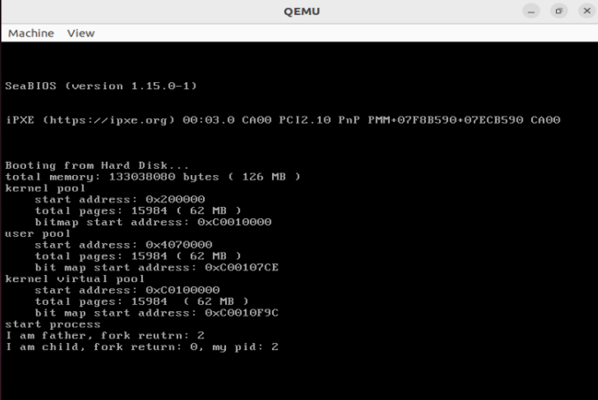

**修改后现象：**

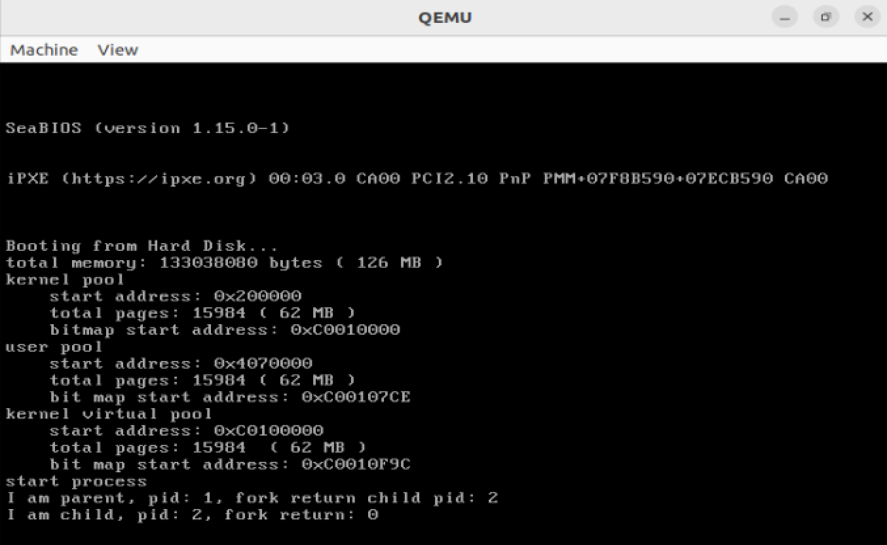

图中父进程输出：

```text
I am parent, pid: 1, fork return child pid: 2
```

子进程输出：

```text
I am child, pid: 2, fork return: 0
```

**实现思路：** 用户态 `fork()` 通过 2 号系统调用进入内核，最终调用 `ProgramManager::fork()`。父进程直接从 `ProgramManager::fork()` 返回子进程 pid；子进程通过复制出来的中断现场恢复执行，且 `copyProcess()` 把子进程现场中的 `eax` 设置为 0。

**fork 的四个关键问题：**

1. 创建独立地址空间：`fork()` 调用 `executeProcess("", 0)` 创建子进程 PCB、页目录表和用户虚拟地址池。
2. 复制用户空间：`copyProcess()` 遍历父进程用户空间前 768 个 PDE，为子进程分配页表和用户物理页，并用内核中转页复制内容。
3. 设置子进程内核栈：复制父进程 `ProcessStartStack` 到子进程 PCB 顶部，然后设置 `child->stack`，使 `asm_switch_thread` 的 `ret` 能跳到 `asm_start_process(childpss)`。
4. 区分返回值：父进程返回 `pid`，子进程的 `childpss->eax = 0`，所以从同一个 `fork()` 调用点返回时得到 0。

**GDB 证据：**

```text
parent   = 0xc0024e20
child    = 0xc0025e20
childpss = 0xc0026ddc
childpss->eax = 0x0
child->stack  = 0xc0026dc0
```

子进程栈内容：

```text
0xc0026dc0: 0x00000000  0x00000000  0x00000000  0x00000000
0xc0026dd0: 0xc0022c20  0x00000000  0xc0026ddc  0x00000000
```

其中 `0xc0022c20` 是 `asm_start_process`，`0xc0026ddc` 是 `childpss`。这说明子进程第一次被调度时，会从 `asm_switch_thread` 返回到 `asm_start_process`，再通过 `iret` 回到用户态 fork 返回点。

---

## Assignment 3 — Wait/Exit 与进程生命周期

### 3.1 Exit 的实现与分析

本小节基于 `src/5`，让父进程 fork 出子进程，子进程显式调用 `exit(42)`。

**复现现象：**

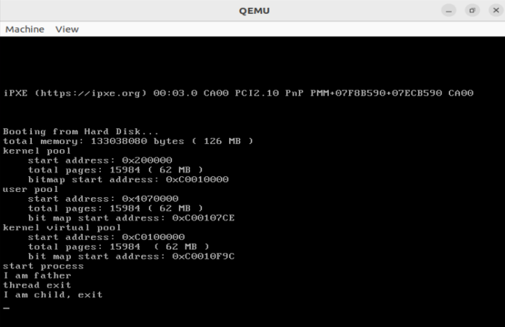

**修改后现象：**

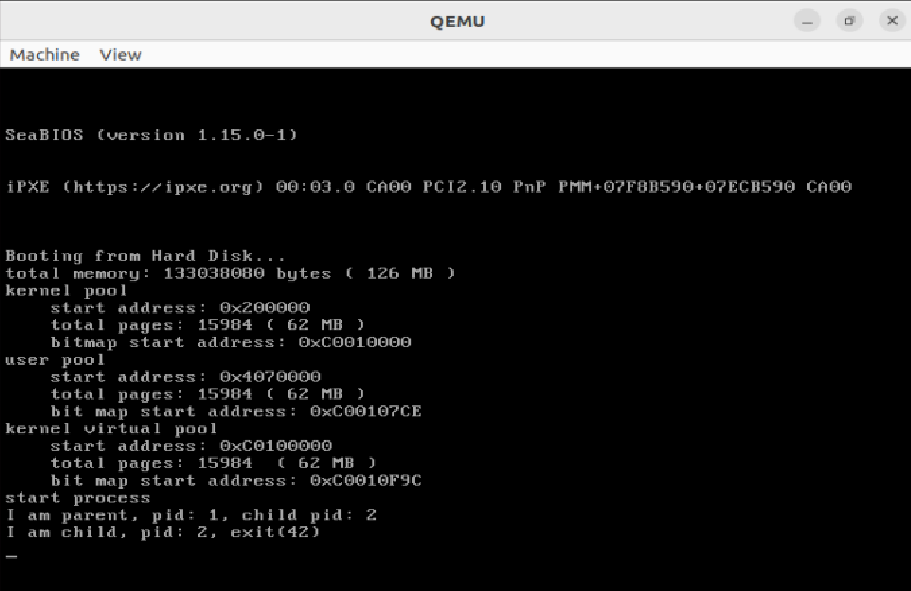

图中可以看到父进程创建了子进程，子进程输出 `exit(42)`。本小节尚未实现 `wait`，因此父进程不会回收子进程 PCB。

**exit 执行流程：**

```text
用户进程 exit(42)
-> asm_system_call(3, 42)
-> int 0x80
-> asm_system_call_handler
-> system_call_table[3]
-> syscall_exit(42)
-> ProgramManager::exit(42)
```

`ProgramManager::exit` 先保存返回值并修改状态：

```cpp
program->retValue = ret;
program->status = ProgramStatus::DEAD;
```

如果退出对象是用户进程，则继续释放用户物理页、页表页、页目录页和用户虚拟地址池 bitmap。最后调用 `schedule()` 切换到其他 READY 程序。

**为什么不会再被调度：** `exit` 已经把当前进程设置为 `DEAD`，并且不会把它重新放入 `readyPrograms`。调度器只从 ready 队列中取下一个程序，所以该进程不会再次运行。PCB 暂时保留，是为了后续 `wait` 能读取 `retValue`。

**正常返回为什么会隐式 exit：** `load_process()` 会在用户栈顶部预置 `exit` 地址和参数 0。用户进程函数正常 `ret` 时，会把这个地址当作返回地址，因此正常返回等价于调用 `exit(0)`。

**GDB 证据：**

```text
ProgramManager::exit entry:
ret = 42
running->pid = 2
running->status = RUNNING
running->retValue = 0

after retValue/status assignment:
running->pid = 2
running->status = DEAD
running->retValue = 42
running->pageDirectoryAddress = 0xc0118000
```

这说明子进程确实进入了 `exit(42)`，并在资源释放前保存返回值、标记为 `DEAD`。

### 3.2 Wait 的实现与父子进程同步

本小节基于 `src/6`，父进程创建两个子进程，两个子进程分别以 42 和 84 退出，父进程循环调用 `wait(&retval)` 回收它们。

**复现现象：**

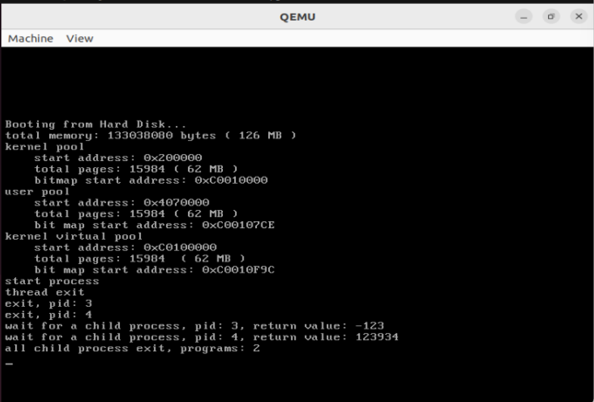

**修改后现象：**

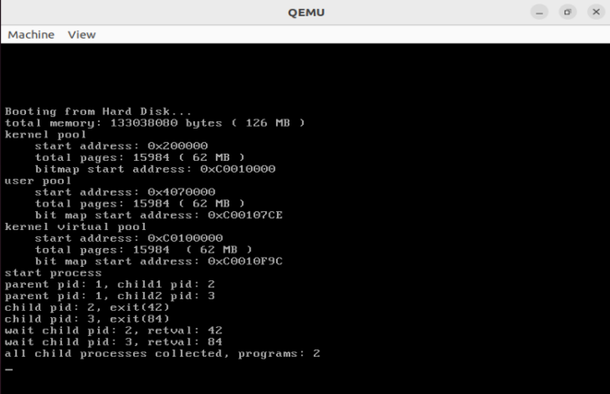

图中可以看到：

```text
child pid: 2, exit(42)
child pid: 3, exit(84)
wait child pid: 2, retval: 42
wait child pid: 3, retval: 84
all child processes collected, programs: 2
```

**wait 执行流程：**

```text
用户进程 wait(&retval)
-> asm_system_call(4, &retval)
-> int 0x80
-> syscall_wait(&retval)
-> ProgramManager::wait(&retval)
```

`ProgramManager::wait` 遍历 `allPrograms`，通过：

```cpp
child->parentPid == this->running->pid
```

判断某个 PCB 是否是当前父进程的子进程。如果找到 `status == DEAD` 的子进程，就把 `child->retValue` 写入 `retval`，保存子进程 pid，调用 `releasePCB(child)` 回收 PCB，并返回 pid。

如果当前父进程还有子进程但没有子进程退出，`wait` 会调用 `schedule()` 主动让出 CPU，等待子进程运行并退出。如果已经没有任何子进程，则返回 `-1`。

**exit 与 wait 的分工：** `exit` 负责保存退出值、释放用户地址空间并把进程标记为 `DEAD`；`wait` 负责读取 `retValue`、返回子进程 pid 并释放 PCB。二者配合完成完整生命周期。

**GDB 证据：**

```text
exit call 1:
ret = 42
running->pid = 2

exit call 2:
ret = 84
running->pid = 3

wait found child 1:
child->pid = 2
child->retValue = 42
child->status = DEAD

wait found child 2:
child->pid = 3
child->retValue = 84
child->status = DEAD
```

这说明两个子进程的退出值都被父进程正确取回。

### 3.3 僵尸进程与孤儿进程处理

本小节在 `Assignment3/3.3` 中实现方案 B：父进程退出时，自动回收已经 `DEAD` 的子进程，并将仍存活的子进程托管给 `pid=0` 的系统 reaper。

**实验现象：**

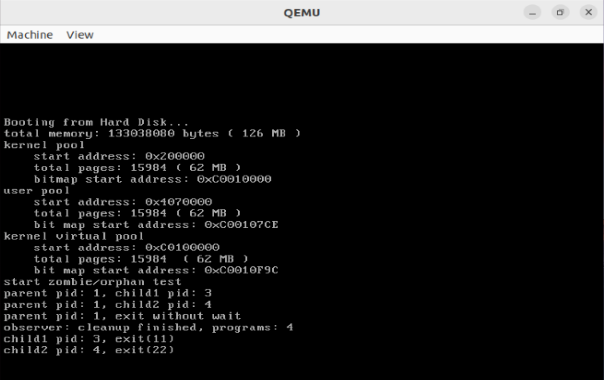

图中可以看到父进程不调用 `wait` 就退出，child1 和 child2 后续也分别退出。由于调度时机不同，输出顺序不要求固定，因此本小节主要结合 GDB 记录说明回收路径。

**实现思路：**

在 `ProgramManager::exit(int ret)` 中，当前进程设置为 `DEAD` 后调用：

```cpp
adoptOrReleaseChildren(program);
```

该函数遍历 `allPrograms`：

```cpp
if (child->parentPid == parent->pid)
{
    if (child->status == ProgramStatus::DEAD)
    {
        releasePCB(child);
    }
    else
    {
        child->parentPid = REAPER_PID;
    }
}
```

其中 `REAPER_PID = 0`。已经退出的子进程直接释放 PCB；仍存活的子进程改为由 reaper 托管。

同时修改 `schedule()`，允许托管给 reaper 的 DEAD 用户进程自动释放：

```cpp
if (!running->pageDirectoryAddress || running->parentPid == REAPER_PID)
{
    releasePCB(running);
}
```

普通父进程还活着时，子进程退出仍然保留为 `DEAD`，等待父进程 `wait`，所以不会破坏 3.2 的语义。

**GDB 证据：**

```text
EXIT ret=11 running_pid=3 parent=1 status=1 pageDir=c0118000
EXIT ret=99 running_pid=1 parent=0 status=1 pageDir=c0100000
ADOPT_MATCH parent=1 child=3 child_parent=1 child_status=4 child_pageDir=c0118000
RELEASE pid=3 parent=1 status=4 pageDir=c0118000
ADOPT_MATCH parent=1 child=4 child_parent=1 child_status=2 child_pageDir=c0118000
ADOPT_LIVE before parent=1 child=4 child_parent=1 child_status=2
RELEASE pid=1 parent=0 status=4 pageDir=c0100000
EXIT ret=22 running_pid=4 parent=0 status=1 pageDir=c0118000
RELEASE pid=4 parent=0 status=4 pageDir=c0118000
```

其中 `RUNNING == 1`，`READY == 2`，`DEAD == 4`。child1 在父进程退出扫描时已经是 `DEAD`，所以被立即回收；child2 当时仍是 `READY`，所以被改为 `parentPid=0`；child2 后续 `exit(22)` 后，调度器因为它属于 reaper 托管进程而自动释放其 PCB。

**结果分析：** 方案 B 的关键是让父进程退出前处理自己的子进程：已经形成的僵尸立即回收，仍存活的孤儿托管给系统 reaper。这样既避免永久僵尸，也避免孤儿退出后无人回收。

---

## Assignment 4 — 选做

### 4.1 新增系统调用：getpid 和 sleep

Assignment4 三个选做题中，我选择 4.1。相比调度策略改进和 Shell 功能增强，`getpid/sleep` 的改动面更小，且可以直接基于 `Assignment3/3.2` 的 `src/6` 进程管理框架完成。

**实验现象：**

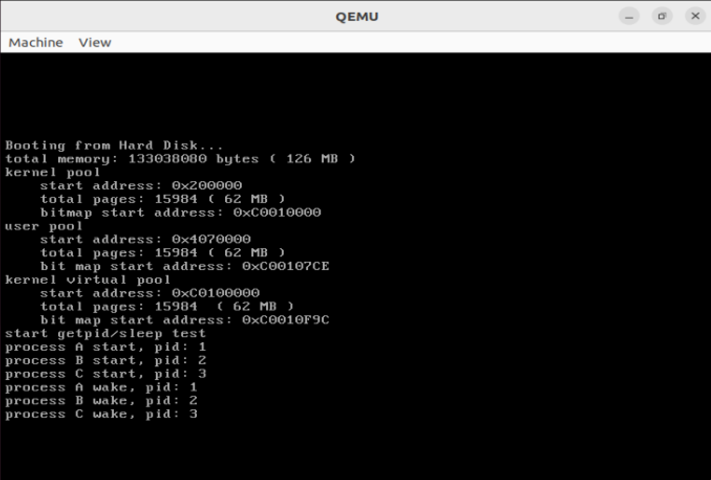

图中可以看到：

```text
start getpid/sleep test
process A start, pid: 1
process B start, pid: 2
process C start, pid: 3
process A wake, pid: 1
process B wake, pid: 2
process C wake, pid: 3
```

三个进程分别打印自己的 pid，并按 `sleep(20)`、`sleep(40)`、`sleep(60)` 的顺序依次唤醒。

**getpid 实现：**

用户态封装：

```cpp
int getpid() {
    return asm_system_call(5);
}
```

内核态处理函数：

```cpp
int syscall_getpid() {
    return programManager.running->pid;
}
```

注册为 5 号系统调用：

```cpp
systemService.setSystemCall(5, (int)syscall_getpid);
```

**sleep 实现：**

在 PCB 中新增：

```cpp
int sleepTicks;
```

在 `ProgramManager` 中新增：

```cpp
List sleepingPrograms;
```

用户态 `sleep(ticks)` 通过 6 号系统调用进入内核。内核态 `ProgramManager::sleep` 将当前进程设为阻塞：

```cpp
running->sleepTicks = ticks;
running->status = ProgramStatus::BLOCKED;
sleepingPrograms.push_back(&(running->tagInGeneralList));
schedule();
```

每次时钟中断调用：

```cpp
programManager.wakeupSleepingPrograms();
```

`wakeupSleepingPrograms()` 遍历睡眠队列，递减 `sleepTicks`，当其变为 0 时把进程从 `sleepingPrograms` 删除，设置为 `READY` 并重新放回 `readyPrograms`。

**GDB 证据：**

```text
GETPID running_pid=1 ret_should=1
SYSCALL_SLEEP pid=1 ticks=20 status=1
PM_SLEEP entry pid=1 ticks=20 status=1
GETPID running_pid=2 ret_should=2
SYSCALL_SLEEP pid=2 ticks=40 status=1
PM_SLEEP entry pid=2 ticks=40 status=1
GETPID running_pid=3 ret_should=3
SYSCALL_SLEEP pid=3 ticks=60 status=1
PM_SLEEP entry pid=3 ticks=60 status=1
WAKE pid=1 sleepTicks=0 status=3
GETPID running_pid=1 ret_should=1
WAKE pid=2 sleepTicks=0 status=3
GETPID running_pid=2 ret_should=2
WAKE pid=3 sleepTicks=0 status=3
```

其中 `RUNNING == 1`，`BLOCKED == 3`。记录说明 `getpid()` 返回值与当前 PCB 的 pid 一致；`sleep()` 会让进程进入阻塞态；`sleepTicks` 到 0 后，A、B、C 按设定 ticks 依次被唤醒。

---

## 总结

本次实验从系统调用入口开始，逐步扩展到用户进程、fork、exit、wait 和进程生命周期管理。系统调用部分验证了 `int 0x80` 和 TSS 栈切换机制；进程部分验证了 PCB、页目录、用户栈和 `iret` 启动用户态的关系；fork/exit/wait 部分展示了父子进程生命周期管理；3.3 进一步处理了父进程退出后的僵尸与孤儿问题；4.1 则新增 `getpid` 和阻塞式 `sleep`，展示了基于时钟中断的简单同步。
